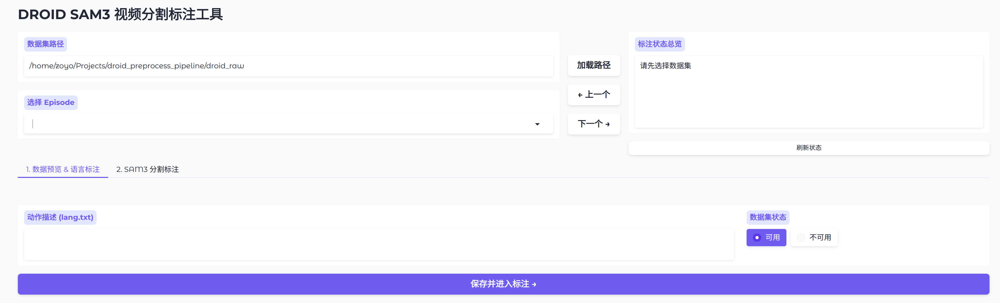
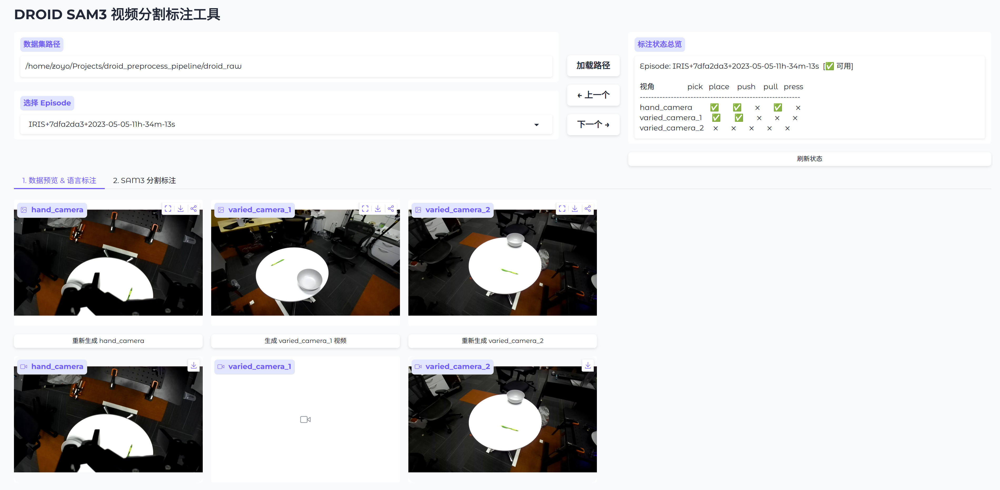
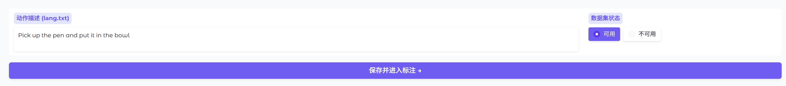
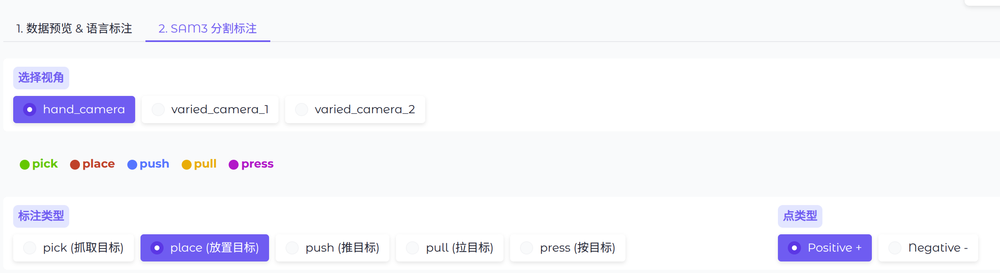
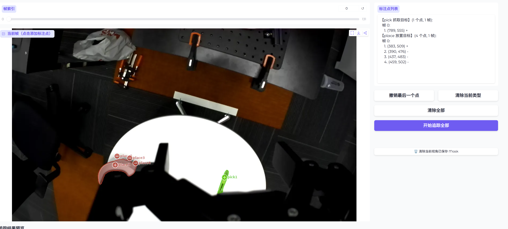
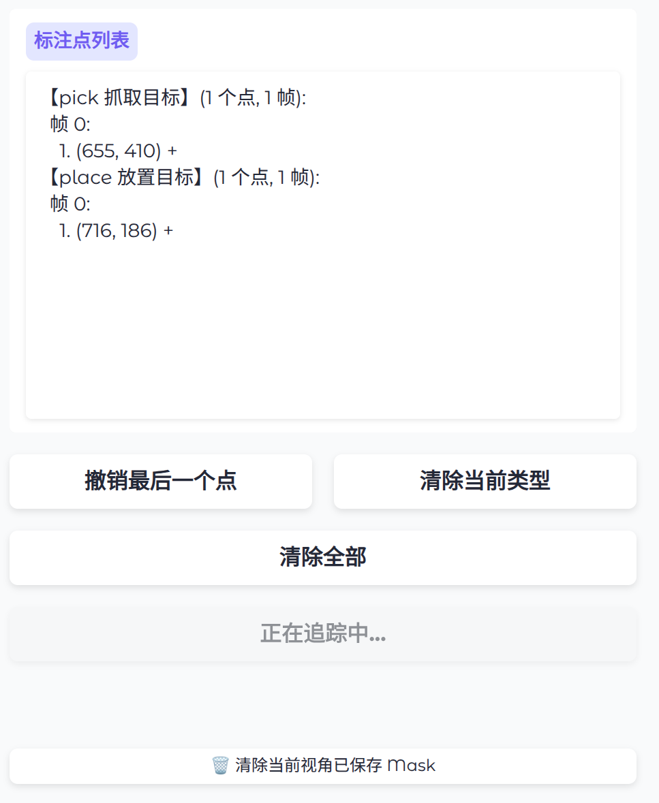
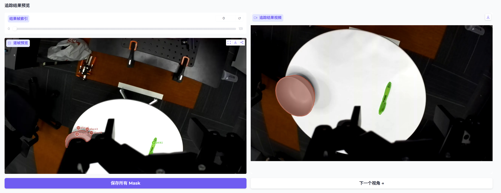
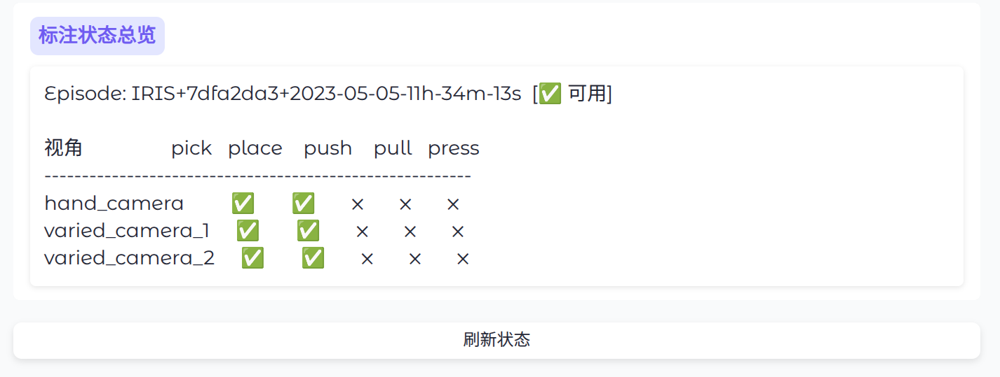

# DROID SAM3 视频分割标注工具

为 DROID 机器人操作数据集构建的交互式视频分割标注工具。使用 Meta SAM 3 模型对多视角操作视频进行逐帧二值 mask 标注，用于后续机器人学习。

## 功能概述

- **可配置数据集路径**: 支持运行时输入/切换数据集根目录，非硬编码
- **Episode 快速切换**: 下拉列表选择 + 上一个/下一个按钮快速导航，切换时自动回到预览页
- **多视角支持**: 自动检测 episode 下所有相机视角（如 hand_camera, varied_camera_1, varied_camera_2），最多支持 6 个视角
- **视频预览**: 将 PNG 帧序列转为 mp4 视频播放，每个相机独立生成，结果缓存避免重复转换
- **语言标注**: 读取/编辑 episode 的动作描述（lang.txt）
- **数据有效性标记**: 可将 episode 标记为可用/不可用，通过 INVALID_MARK 文件实现
- **SAM3 交互式分割**: 点击添加正/负点 → 自动预览 mask → 全视频追踪
- **5 种 mask 类型**: pick(抓取目标) / place(放置目标) / push(推目标) / pull(拉目标) / press(按目标)
- **多类型同时标注**: 可在同一帧上同时为多种 mask 类型添加标注点，一次性追踪全部
- **多帧修正支持**: 标注点按帧存储，追踪后可在问题帧添加修正点（正/负点），重新追踪时使用所有帧的点
- **自动 Mask 预览**: 每次点击添加/撤销点后自动预览 mask，无需手动触发
- **半透明标注点**: 标注点使用 RGBA 半透明渲染，不完全遮挡图像
- **追踪结果双栏预览**: 逐帧图片浏览 + 视频回放
- **追踪按钮状态反馈**: 追踪过程中按钮变灰显示"正在追踪中..."，完成后恢复
- **完整序列保存**: 没有目标的帧自动保存全零 mask，确保输出帧数与原视频一致
- **Mask 合并导出**: 将 5 种 mask 合并为单个 `.npz` 文件，支持按键名读取
- **标注状态总览**: 顶部固定区域，实时显示各视角各 mask 类型的完成状态，保存后自动刷新
- **异步 Session 加载**: SAM3 session 在后台线程加载，不阻塞 UI 交互

## 项目结构

```
droid_sam3_annotator/
├── pyproject.toml           # UV 项目配置 + 依赖
├── app.py                   # Gradio 主应用入口（2 个 Tab + 顶部固定区域）
├── sam3_backend.py          # SAM3 VideoPredictor 推理封装
├── data_utils.py            # 数据集读取/保存/视频生成/有效性标记工具
├── merge_masks.py           # Mask 合并导出脚本（PNG → npz）
├── assets/                  # 静态资源
└── README.md
```

## 技术栈

| 组件 | 技术 |
|------|------|
| 前端 UI | Gradio >= 5.0 |
| 分割模型 | SAM 3 ([facebook/sam3](https://github.com/facebookresearch/sam3)) |
| 深度学习 | PyTorch >= 2.7.0 |
| 环境管理 | UV |
| 视频转换 | ffmpeg |
| 图像处理 | Pillow, NumPy, SciPy |

## 安装与运行

### 前置要求

- Python >= 3.12
- CUDA GPU（SAM3 需要 ~7GB 显存）
- ffmpeg（用于视频预览生成）
- UV 包管理器

### 安装

```bash
cd droid_sam3_annotator
uv sync  # 自动创建虚拟环境并安装依赖
```

首次运行会从 HuggingFace 下载 SAM3 模型权重（~3.5GB）。

### 运行

```bash
uv run python app.py
```

启动时会预加载 SAM3 模型（避免标注时等待），加载完成后访问 http://localhost:7860

## 数据集格式

### 输入

```
droid_raw/
├── {episode_name}/
│   ├── lang.txt                          # 动作描述
│   ├── INVALID_MARK                      # 可选，存在则标记该 episode 不可用
│   └── rgb_stereo_valid/
│       ├── {camera}/left/
│       │   ├── 00000.png                 # 帧图像 (RGB)
│       │   ├── 00001.png
│       │   └── ...
│       └── frame_mapping.json
```

相机名称自动检测（扫描 `rgb_stereo_valid/` 下含 `left/` 子目录的文件夹）。

### 标注输出（逐帧 PNG）

```
{episode_name}/mask/{camera}/left/
├── pick/
│   ├── 00000.png    # 二值 mask (0=背景, 255=前景)
│   ├── 00001.png    # 未追踪到目标的帧为全零
│   └── ...          # 帧数与原视频一致
├── place/
├── push/
├── pull/
└── press/
```

### 合并输出（npz）

```
{episode_name}/heatmap/{camera}/left/
├── 00000.npz    # 每个文件包含 5 个键
├── 00001.npz
└── ...
```

读取方式：

```python
import numpy as np
data = np.load("00000.npz")
data["pick"]    # (H, W), dtype=uint8, 值为 0 或 1
data["place"]   # (H, W)
data["push"]    # (H, W)
data["pull"]    # (H, W)
data["press"]   # (H, W)
```

## 操作流程

### 步骤 1: 加载数据集

在顶部「数据集路径」输入框中填写包含所有 episode 的根目录路径，点击「加载路径」按钮。加载成功后，episode 下拉列表会自动填充，右侧「标注状态总览」显示当前 episode 各视角各类型的完成状态。

可使用「← 上一个」「下一个 →」按钮快速切换 episode（自动跳回 Tab 1）。



### 步骤 2: 预览数据集（可选）

在 Tab 1「数据预览 & 语言标注」中，各视角的首帧图像会自动显示。点击每个视角下方的「生成视频」按钮可将 PNG 帧序列转为 mp4 视频预览，帮助了解该 episode 的操作流程。每个视角独立生成，生成过程中按钮显示"生成中..."。

视频生成结果会缓存，同一 episode 同一相机不会重复转换。



### 步骤 3: 语言标注 & 数据有效性

- **动作描述**: 在「动作描述 (lang.txt)」文本框中查看或编辑该 episode 的动作描述。若 `lang.txt` 不存在则显示为空，可直接输入。
- **数据集状态**: 右侧 Radio 按钮可将 episode 标记为「可用」或「不可用」。标记为不可用时，会在 episode 目录下生成 `INVALID_MARK` 文件；对于多目标任务等不适合标注的数据，标记为不可用后可跳过剩余步骤，直接切换到下一个 episode。
- 完成后点击「保存并进入标注 →」保存 `lang.txt` 并自动跳转 Tab 2。



### 步骤 4: 选择视角和标注类型

进入 Tab 2「SAM3 分割标注」后：

1. **选择视角**: 顶部 Radio 选择当前处理的相机（如 hand_camera / varied_camera_1 / varied_camera_2），切换视角会重置标注状态并在后台异步加载新的 SAM3 session
2. **选择标注类型**: 从 pick(抓取目标) / place(放置目标) / push(推目标) / pull(拉目标) / press(按目标) 中选择，上方有颜色图例对照
3. **选择点类型**: Positive + (正点，标记目标区域) 或 Negative - (负点，排除非目标区域)



### 步骤 5: 标记目标区域

1. 用帧索引 Slider 导航到合适的帧（通常选第 0 帧或目标最清晰的帧）
2. 在图像上点击添加标注点：
   - 每个点显示为半透明彩色圆圈，内含白色 +/- 符号，旁标类型名+编号（如 pick1, place2）
   - 不同 mask 类型用不同颜色区分
   - **点击后自动预览 mask**（半透明彩色填充 + 描边轮廓），无需手动触发
3. 可切换标注类型，在同一帧上为多种类型添加点（如同时标注 pick 和 place）
4. 用 Negative - 点排除不需要的区域，精细修正 mask 边界
5. 右侧「标注点列表」实时显示所有类型在所有帧上的点信息

**点操作按钮：**
- 「撤销最后一个点」— 撤销当前类型在当前帧的最后一个点，自动重新预览
- 「清除当前类型」— 清除当前类型在当前帧的所有点
- 「清除全部」— 重置所有标注状态（所有类型的点、预览 mask、追踪结果、SAM3 session）



### 步骤 6: 追踪全视频

确认预览 mask 满意后，点击「开始追踪全部」按钮。SAM3 会将所有帧上所有类型的标注点一次性传播追踪到全视频。

- 追踪过程中按钮变灰显示「正在追踪中...」，请耐心等待
- 追踪完成后自动生成预览视频，按钮恢复为可点击状态



### 步骤 7: 检查追踪结果 & 修正

追踪完成后，页面下方「追踪结果预览」区域会显示：
- **左栏**: 结果帧 Slider + 逐帧图片预览（所有类型 mask 叠加显示，带彩色描边）
- **右栏**: 自动生成的追踪结果视频

**请仔细检查追踪结果**，注意以下问题：
- 目标是否在某些帧中丢失
- 是否有错误标记的区域（如背景被误标为目标）
- mask 边界是否准确

**如需修正**：
1. 用帧索引 Slider 导航回标注区域，找到有问题的帧
2. 在该帧上添加修正点（正点恢复遗漏区域，负点排除多余区域）
3. 点击后自动预览修正效果
4. 可在多个问题帧上分别添加修正点
5. 重新点击「开始追踪全部」— 系统会使用所有帧上的所有点（包括初始标注帧和修正帧的点）重新追踪

**确认结果无误后，务必点击「保存所有 Mask」保存结果！** 未保存直接切换视角或 episode 会导致追踪结果丢失。

如果之前错误保存了 mask，可点击「🗑️ 清除当前视角已保存 Mask」按钮删除当前视角的所有已保存 mask 文件。

保存完成后点击「下一个视角 →」继续处理下一个相机。



### 步骤 8: 完成所有视角

对每个视角重复步骤 4-7，直到所有视角的所需 mask 类型全部标注完成。右上角的「标注状态总览」会实时显示各视角各类型的完成状态（✅/❌），保存 mask 后自动刷新。

所有视角标注完毕后，使用「← 上一个」或「下一个 →」按钮切换到下一个 episode 继续标注。



### 可视化说明

| Mask 类型 | 颜色 | 中文 |
|-----------|------|------|
| pick | 绿色 (0, 200, 0) | 抓取目标 |
| place | 红色 (220, 40, 40) | 放置目标 |
| push | 蓝色 (0, 128, 255) | 推目标 |
| pull | 橙色 (255, 165, 0) | 拉目标 |
| press | 紫色 (200, 0, 200) | 按目标 |

Mask 叠加：半透明彩色填充（alpha=0.35）+ 同色描边轮廓，多类型可同时显示。预览 mask 优先于追踪 mask 显示（同一帧同一类型时）。

### Mask 合并（独立脚本）

所有 episode 标注完成后，使用 `merge_masks.py` 将 5 种 mask 合并为 `.npz`：

```bash
uv run python merge_masks.py /path/to/episode_00000
```

自动检测所有相机，逐帧合并输出到 `heatmap/{camera}/left/` 目录。

## SAM3 后端说明

### API 模式

SAM3 使用 session-based API，与 SAM2 不同：

```
start_session(resource_path) → session_id
model.add_prompt(inference_state, frame_idx, points, point_labels, obj_id, rel_coordinates) → outputs
propagate_in_video(session_id, direction) → generator of (frame_idx, outputs)
reset_session(session_id)
close_session(session_id)
```

### 坐标系处理

SAM3 内部将所有帧 resize 到 **1008×1008** 进行推理：

1. Gradio `select` 事件返回原始图像像素坐标 `(x, y)`
2. `SAM3Annotator.add_points()` 自动归一化为 `(x/width, y/height)` 范围 `[0, 1]`
3. SAM3 内部乘以 1008 映射到内部空间（`rel_coordinates=True`）
4. 输出 mask 自动 resize 回原始分辨率 `(H_orig, W_orig)`

无需手动处理坐标转换，输出 mask 尺寸与原图一致。

### Point Prompting 注意事项

SAM3 的 point prompting 走 tracker 路径（`add_tracker_new_points`），有两个关键补丁：

1. **缓存预填充**: `init_video()` 在创建 session 后为所有帧预填充 `cached_frame_outputs = {}`，使 point prompting 可直接使用
2. **传播标记**: `add_points()` 后手动设置 `previous_stages_out[frame_idx]`，因为 tracker 路径不会自动标记，但 `propagate_in_video` 依赖此字段判断是否有 prompt

### 多对象追踪

每种 mask 类型对应一个 `obj_id`（pick=1, place=2, push=3, pull=4, press=5），SAM3 支持同时追踪多个对象。`track_all()` 一次性传播所有对象，返回按 obj_id 分组的结果。

### 多帧 Point Prompting

追踪前会将所有帧上所有类型的点通过 `add_prompt` 传给 SAM3，支持在多个帧上为同一对象添加标注点。这是多帧修正的基础——在初始标注帧之外的问题帧添加修正点后重新追踪，SAM3 会综合所有帧的信息进行传播。

### dtype 处理

SAM3 推理需要 `torch.autocast("cuda", dtype=torch.bfloat16)` 上下文，否则会出现 BFloat16/Float32 类型不匹配错误。`add_points()` 和 `track_all()` 内部已自动包裹 autocast。

### 输出格式

`add_prompt` 和 `propagate_in_video` 返回的 outputs 包含：
- `out_obj_ids`: 对象 ID 数组
- `out_binary_masks`: 二值 mask 数组 `(N, H_orig, W_orig)`, dtype=bool
- `out_probs`: 置信度
- `out_boxes_xywh`: 边界框

## 关键实现细节

### UI 层

- **可配置数据集路径**: `DEFAULT_DATASET_ROOT` 可通过 UI 运行时修改，存储在 `current_state["dataset_root"]`
- **顶部固定区域**: 数据集路径、episode 选择、上/下一个按钮、标注状态总览不随 Tab 切换
- **动态相机检测**: `list_cameras()` 扫描 `rgb_stereo_valid/` 子目录，不硬编码相机名称
- **固定槽位模式**: `MAX_CAMERAS=6` 个预建组件，通过 `visible` 属性动态显示/隐藏
- **点击交互**: Gradio Image 组件的 `select` 事件获取点击坐标
- **自动 mask 预览**: 每次添加/删除点后立即调用 `_auto_preview()` 预览 mask，无需手动按钮
- **生成器 yield**: 视频生成和追踪使用 Gradio generator 模式，支持按钮状态实时反馈
- **模型预加载**: `app.py` 的 `__main__` 在 `build_app()` 前调用 `get_sam3()` 加载模型
- **Tab 自动切换**: 点击上/下一个 episode 按钮后自动切换到 Tab 1

### 异步 Session 管理

- **后台线程加载**: 切换 episode/相机时，SAM3 session 在后台线程中初始化（`_ensure_session_async`），不阻塞 UI
- **版本号防竞争**: `_session_version` 计数器，每次请求新 session 时递增，旧线程完成后检查版本号，不匹配则不标记 `session_initialized`
- **同步等待**: 实际需要 session 时（如 `_auto_preview`、`on_track`），调用 `_ensure_session()` 等待后台线程完成
- **重复加载防护**: `on_camera_change` 中通过 `already_set` 检测是否由 `on_episode_select` 触发，避免重复初始化

### 标注状态管理

- **按帧存储点**: `points_per_type = {mask_type: {frame_idx: [(x, y, label), ...]}}` 支持多帧修正
- **预览 mask 存储**: `preview_masks = {mask_type: (frame_idx, mask)}` 记录预览帧索引，仅在对应帧显示
- **预览优先级**: 渲染时预览 mask 优先于追踪 mask（同一帧同一类型时以预览为准）
- **全局状态**: 使用全局 `current_state` dict 管理所有标注状态，仅支持单用户使用

### 可视化层

- **半透明标注点**: PIL RGBA overlay 模式绘制半透明彩色圆圈 + 白色描边 + 内含 +/- 符号 + 旁标类型名+编号
- **Mask 叠加**: 半透明填充（alpha=0.35）+ `scipy.ndimage.binary_dilation` 计算轮廓描边
- **颜色图例**: HTML 渲染彩色圆点，放在 mask 类型 Radio 上方

### 数据层

- **视频缓存**: `build_preview_video()` 结果缓存在 `_video_cache` dict，避免重复转换
- **完整序列保存**: `save_masks()` 遍历 `0 ~ total_frames-1`，缺失帧保存全零 PNG
- **结果视频**: `build_result_video()` 渲染所有帧的 mask overlay → 临时目录 → ffmpeg 合成 mp4
- **有效性标记**: `INVALID_MARK` 文件的存在/缺失控制 episode 可用状态

## 依赖列表

```
torch>=2.7.0
torchvision
sam3 (from github.com/facebookresearch/sam3)
gradio>=5.0
numpy
Pillow
scipy
setuptools<81    # SAM3 依赖 pkg_resources，82+ 已移除
einops           # SAM3 未声明的依赖
psutil           # SAM3 未声明的依赖
decord           # SAM3 未声明的依赖
pycocotools      # SAM3 未声明的依赖
```

## 已知问题与注意事项

1. **setuptools 版本**: SAM3 使用 `import pkg_resources`，需要 `setuptools<81`
2. **显存占用**: SAM3 模型约需 7GB 显存，视频帧数多时追踪过程会额外占用
3. **首次启动**: 需下载 SAM3 模型权重（~3.5GB），之后使用缓存
4. **全局状态**: 当前使用全局 `current_state` dict 管理标注状态，仅支持单用户使用
5. **ffmpeg 依赖**: 视频预览和结果视频生成依赖系统安装的 ffmpeg
6. **Session 切换**: 切换 episode 或相机时会关闭旧 session 并创建新 session，旧追踪结果会被清除
7. **多帧修正**: 重新追踪时 SAM3 session 会被完全重新初始化，确保干净状态
